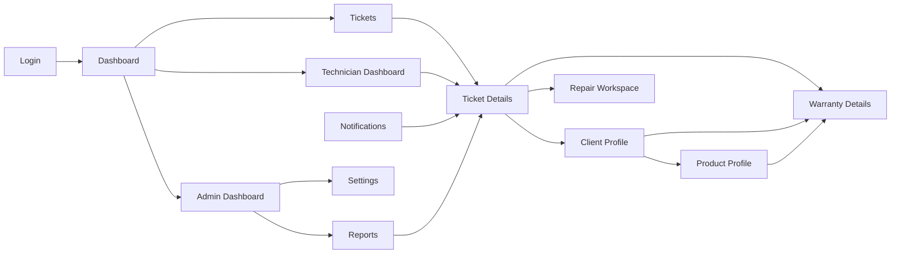

# ServiceDesk SaaS — UX/UI Design System

## Product direction

An efficient, calm repair-service workspace for support agents, technicians, managers, and administrators. The visual language is minimal: ample whitespace, one primary action per screen, low-contrast surfaces, and status colour used only where it carries meaning. The application is **desktop-first for operations** and fully responsive for field technicians and clients.

**Design stack:** Tailwind CSS v4, shadcn-style primitives, Lucide icons, and CSS custom properties for semantic theme tokens.

## UI hierarchy

```text
App shell
├─ Utility bar: organization switcher · global search · theme · notifications · user menu
├─ Desktop sidebar / mobile sheet
│  ├─ Workspace: Dashboard, Tickets, Clients, Products, Warranties
│  ├─ Operations: Repairs, Technician workspace
│  ├─ Insights: Reports
│  └─ Administration: Users & roles, Settings, Audit log
└─ Page
   ├─ Breadcrumb + title + contextual primary action
   ├─ Optional summary/KPI row
   ├─ Main task content
   └─ Context panel or sheet (activity, assignments, filters, metadata)
```

### Navigation behavior

| Breakpoint | Navigation | Page behavior |
|---|---|---|
| `≥1280px` | Persistent 256px sidebar; page context panel may be visible | Dense tables and two-column detail layout |
| `768–1279px` | Collapsed 72px icon rail; sidebar expands as sheet | Tables retain key columns; details stack where needed |
| `<768px` | Header with menu sheet and bottom quick actions | Cards replace tables; filters and secondary content open in sheets |

## Navigation flow



## Wireframes

### 1. Login

```text
┌──────────────────────────────────────────────────────────────────────┐
│  ServiceDesk                                         Help · Language  │
│                                                                      │
│        ┌──────────────────────────────────────────┐                  │
│        │ Welcome back                              │                  │
│        │ Sign in to manage your service operations │                  │
│        │ Email                                     │                  │
│        │ [ name@company.com                       ] │                  │
│        │ Password                  Forgot password │                  │
│        │ [ •••••••••••••••                       ] │                  │
│        │ [✓] Remember me                           │                  │
│        │ [              Sign in                  ] │                  │
│        │             SSO sign-in                    │                  │
│        └──────────────────────────────────────────┘                  │
└──────────────────────────────────────────────────────────────────────┘
```

Error appears beneath its field; retain entered email; rate-limit messaging stays neutral. Support password manager, SSO, keyboard submit, and accessible “show password”.

### 2. Dashboard

```text
┌Sidebar────────┬──────────────────────────────────────────────────────┐
│ ◈ ServiceDesk │ Good morning, Maya                     [New ticket]  │
│ ▣ Dashboard   │ [Open 24] [Due today 7] [Awaiting client 9] [SLA 94%]│
│ ◉ Tickets     │                                                       │
│ ◌ Clients     │ Ticket queue                     Team workload       │
│ ◫ Products    │ ┌─────────────────────────┐   ┌───────────────────┐ │
│ ◇ Warranties  │ │ Priority · Ticket · Owner│   │ A. Noor  6/8 hrs │ │
│ ◉ Repairs     │ │ High     #T-1042  Samira │   │ B. Khan  5/8 hrs │ │
│ ◔ Reports     │ └─────────────────────────┘   └───────────────────┘ │
│ ⚙ Settings    │ SLA trend / tickets by status                         │
└───────────────┴──────────────────────────────────────────────────────┘
```

KPI cards open a pre-filtered ticket list. The dashboard is role-aware: technicians see their tasks and capacity; admins see team and system health.

### 3. Ticket list

```text
Tickets                                             [Export] [New ticket]
[ Search ticket, client, serial… ] [Status ▾] [Priority ▾] [More filters]
┌───────┬──────────────────────┬─────────────┬──────────┬────────┬─────┐
│ ID    │ Subject / Client     │ Assignee    │ Status   │ SLA    │  ···│
│T-1042 │ Screen flickers      │ A. Noor     │ In prog. │ 1h 24m │     │
│T-1039 │ Battery replacement  │ Unassigned  │ New      │ 5h 10m │     │
└───────┴──────────────────────┴─────────────┴──────────┴────────┴─────┘
                 1–50 of 1,240                         ‹ 1 2 3 … ›
```

Desktop uses a sortable, selectable data table with saved views. Mobile uses `TicketCard` with status, priority, client, assignee, and SLA only; filter state is shown as removable chips.

### 4. Ticket details / repair workspace

```text
‹ Tickets / T-1042                         [Assign] [Change status ▾]
Screen flickers after 10 minutes                  In progress · High
┌───────────────────────────────────────┬──────────────────────────────┐
│ Activity  Details  Files               │ Client                       │
│ ● You assigned A. Noor · 2m            │ Samira Bennani   View profile│
│ ● A. Noor: checking display cable      │ +212… · samira@…             │
│ [ Add internal note…              Send]│ ──────────────────────────── │
│                                       │ Product & warranty           │
│ Repair                                 │ ThinkPad X1 · SN…            │
│ Status [Repairing ▾]  Cost [ 0.00 ]   │ Active until 12 Sep 2027     │
│ Diagnosis [                         ] │                               │
└───────────────────────────────────────┴──────────────────────────────┘
```

Use tabs, not a long page: Activity (default), Details, Repair, Files. The right rail is sticky on wide screens, becomes a “Context” sheet on smaller screens. Internal notes and client-visible updates must be visually and semantically distinct.

### 5. Client, warranty, and product profiles

```text
Client: Samira Bennani                              [Edit] [New ticket]
[Contact & addresses]  [Tickets 12]  [Products 3]  [Invoices 2]
 ├─ Overview: status, contact, preferred address, lifetime value
 ├─ Tickets: reusable filtered TicketTable
 ├─ Products: product / serial / warranty state / expiry
 └─ Invoices: amount / payment status / due date

Warranty: W-02491       Active                         [Start claim]
Product · serial number · owner · purchase date · coverage start/end
Claim / repair timeline                 Supporting files

Product: ThinkPad X1 Carbon                              [Edit product]
Brand · category · SKU/model · service notes
Instances / warranties table                             Related tickets
```

### 6. Technician dashboard

```text
My work                                      Today · 8 hours capacity
[Assigned 6] [Due today 2] [Awaiting parts 1]       [Availability ▾]
┌ Now / overdue ───────────────────────────────────────────────────────┐
│ 09:30  T-1042 Screen flickers  · High · 1h 24m SLA   [Open repair]   │
└──────────────────────────────────────────────────────────────────────┘
Kanban: Received | Diagnosing | Awaiting parts | Repairing | QC
```

Prioritize “what do I do next?”—not reporting. Drag-and-drop is optional; every state change has an accessible menu alternative and confirmation only for irreversible transitions.

### 7. Admin, notifications, reports, settings

```text
Admin dashboard: [Active users] [Open tickets] [SLA] [Unassigned]
                  Team workload · Recent audit activity · System alerts

Notifications: [All] [Unread]  • Assignment  • SLA breach  • Comment
               Mark all read | each item links directly to its record

Reports: range [Last 30 days ▾] [Team ▾] [Export]
         SLA performance · Ticket volume · Resolution time · Technician load
         chart + compact data table + definitions/tooltips

Settings: vertical tabs — Organization | Users & roles | Ticketing/SLA |
          Notifications | Integrations | Appearance | Security
```

## Visual foundations

### Colour palette

Use semantic tokens rather than hard-coded Tailwind colours. Ensure normal text has ≥4.5:1 contrast; visible focus rings ≥3:1.

| Token | Light | Dark | Use |
|---|---:|---:|---|
| `--background` | `#F8FAFC` | `#0B1220` | application canvas |
| `--surface` | `#FFFFFF` | `#111827` | cards, sheets, inputs |
| `--foreground` | `#0F172A` | `#F8FAFC` | primary text |
| `--muted` | `#64748B` | `#94A3B8` | secondary text |
| `--border` | `#E2E8F0` | `#243047` | dividers and input borders |
| `--primary` | `#2563EB` | `#60A5FA` | CTA, selected navigation |
| `--success` | `#15803D` | `#4ADE80` | completed / active |
| `--warning` | `#B45309` | `#FBBF24` | pending / at risk |
| `--danger` | `#DC2626` | `#F87171` | overdue / destructive |

Status must pair colour with an icon and label. Use `Badge` variants: neutral, info, success, warning, danger; do not use red/green alone.

### Typography and spacing

- **Font:** Inter, system fallback; Material Symbols only for icons.
- **Type scale:** display `30/36 700`; H1 `24/32 700`; H2 `20/28 600`; body `14/20 400`; label `12/16 600`; numeric KPI `28/32 700` with tabular figures.
- **Spacing:** 4px base; use Tailwind spacing steps `2, 3, 4, 6, 8`. App shell padding: 24px desktop / 16px mobile. Cards: 20–24px padding, `rounded-xl`.
- **Interaction:** 40px minimum controls (44px touch targets on mobile), `transition-colors duration-150`, restrained shadows (`shadow-sm` only on elevated surfaces).

## Component inventory

| Layer | Components |
|---|---|
| Primitives | `Button`, `Input`, `Textarea`, `Select`, `Checkbox`, `Switch`, `Tabs`, `Dialog`, `Sheet`, `Popover`, `Tooltip`, `DropdownMenu`, `Skeleton`, `Toast`, `Badge`, `Avatar`, `Calendar` |
| Layout | `AppShell`, `Sidebar`, `MobileNavSheet`, `PageHeader`, `Breadcrumbs`, `ContextPanel`, `EmptyState`, `ErrorState`, `LoadingState` |
| Data | `DataTable`, `FilterBar`, `FilterChip`, `SavedViewMenu`, `SearchCommand`, `Pagination`, `MetricCard`, `StatusBadge`, `SlaIndicator`, `ActivityTimeline` |
| Domain | `TicketCard`, `TicketComposer`, `AssignmentSelect`, `RepairStageControl`, `WarrantySummary`, `ClientIdentityCard`, `ProductSummary`, `FileUploader`, `NotificationItem`, `ReportChart` |

### Tailwind / shadcn implementation conventions

```tsx
// Semantic class usage: tokens change automatically with .dark.
<Card className="border-border bg-card text-card-foreground shadow-sm">
  <CardHeader className="space-y-1 p-5">
    <Badge variant="warning"><span className="material-symbols-rounded">schedule</span> Due today</Badge>
  </CardHeader>
</Card>
```

- Enable class-based dark mode and persist the user choice; respect `prefers-color-scheme` before a preference is set.
- Build tables through the shared `DataTable` wrapper; keep filtering, sorting, and pagination server-side.
- Use `Dialog` for focused confirmations/forms, `Sheet` for filters/context on mobile, and `Toast` only for non-blocking acknowledgement.
- All icons need an adjacent label, tooltip, or accessible name. Never place a destructive action next to a frequent action without separation.

## UX recommendations and acceptance criteria

1. **Search is a primary workflow.** Provide global `⌘/Ctrl+K` search for ticket number, client, serial, and product; show recent records and navigate without forcing an exact match.
2. **Make urgency legible.** SLA indicator shows label, remaining time, and threshold—not a colour-only countdown. Escalate only near breach and avoid permanent visual alarm.
3. **Protect against accidental state changes.** Require an explanation for cancellation/void, show what a transition will notify, and write every business change to the activity log.
4. **Optimize data entry.** Preserve drafts, enable keyboard navigation, prefill known client/product data, validate on blur plus submit, and retain form data after recoverable failures.
5. **Design honest states.** Every collection has loading skeletons, a no-results filtered state, an empty first-use state with CTA, and an inline retryable error state.
6. **Accessibility is release-blocking.** Keyboard navigation, visible focus, labelled inputs, live-region success/errors, semantic tables, 200% zoom support, and WCAG 2.2 AA contrast are required.
7. **Measure outcome.** Instrument time-to-create ticket, ticket reassignment rate, median time-to-first-response, repair cycle time, and task completion/error rates per role.
